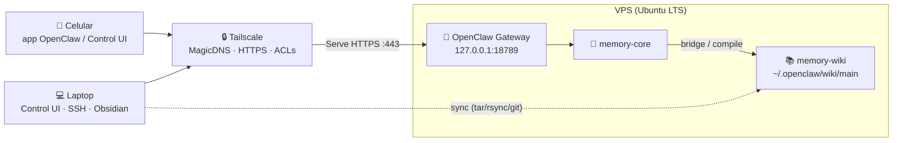

# 🦞 Guía de despliegue: OpenClaw + Tailscale + Memory Wiki + Obsidian

> Guía complementaria de la charla **Harness Engineering** (Chihuahua Tech Week 2026). Basada en un despliegue real sobre Ubuntu LTS y contrastada con la documentación oficial en septiembre de 2026. Los comandos cambian entre versiones: si algo no coincide, manda la doc oficial (enlaces al final).

**En una frase:** vas a montar un agente personal en un VPS, con memoria persistente en Markdown, vista de grafo en Obsidian y acceso solo desde tus dispositivos por una red privada. Sin abrir puertos a internet. Tiempo: **1–2 horas**. Costo: **VPS + uso de la API del modelo** (ver [Costos](#costos)).

---

## 1. ¿Qué vas a construir?

Un arnés completo alrededor de un modelo:

- Un **agente** (OpenClaw) corriendo 24/7 en un servidor propio.
- Acceso desde **celular y laptop** sin exponer nada: todo pasa por **Tailscale**.
- Una **memoria persistente** en un vault de Markdown que el agente compila.
- Una **vista de grafo** en **Obsidian** para curar esa memoria con tus manos.

El resultado: la memoria deja de vivir en tu cabeza (o en un chat que se reinicia) y pasa a archivos que puedes leer, editar, versionar y auditar.

---

## 2. Arquitectura



En texto: **Celular/Laptop → Tailscale (red privada) → VPS con OpenClaw → vault Markdown ↔ Obsidian.** El Gateway escucha solo en loopback; Tailscale Serve le da HTTPS dentro de la tailnet; el vault se copia a tu laptop para abrirlo en Obsidian.

---

## 3. Componentes, uno por uno

### 🦞 OpenClaw — el agente

**Qué es.** Gateway open source (MIT) que corre en tu hardware y conecta tus apps de chat con agentes de IA. Un solo proceso **Gateway** es la fuente de verdad; el agente vive con su *workspace* (`AGENTS.md`, `SOUL.md`, `USER.md`, `IDENTITY.md`).

**Qué hace.** Expone el **Control UI** y una API WebSocket en `18789`; conecta **canales** (Telegram, Discord, WhatsApp, Signal, Slack…) y **nodos** móviles; da **herramientas** (shell, archivos, web) y **skills**; ejecuta trabajo programado (**automations**, hooks, heartbeat); y mantiene la **memoria** (`memory-core` dueño del recall y *dreaming*; `memory-wiki` compila la wiki).

**Por qué importa.** Es el "arnés" del modelo: reglas, herramientas, contexto y verificación en archivos que tú controlas. Al ser self-hosted, datos y secretos no pasan por un servicio de terceros.

📚 <https://docs.openclaw.ai> · <https://docs.openclaw.ai/concepts/architecture> · <https://docs.openclaw.ai/channels> · <https://docs.openclaw.ai/automation>

### 🔒 Tailscale — la red privada

**Qué es.** Malla punto a punto basada en WireGuard que crea tu propia **tailnet**: coordinación por Tailscale, tráfico cifrado directo entre nodos.

**Qué hace.** Da a cada dispositivo una IP estable (`100.x.y.z`) y nombre DNS con **MagicDNS**; permite administrar el VPS **sin abrir el puerto 22 a internet**; aplica **ACLs/grants** deny-by-default desde el policy file; y **Serve** publica un servicio local como HTTPS dentro de la tailnet, con certificado de Let's Encrypt y headers de identidad (`Tailscale-User-Login`). **Funnel** hace lo mismo pero público: aquí **no se usa**.

**Por qué importa.** Elimina la superficie de ataque: el firewall puede descartar todo lo que no venga de la tailnet. Es la diferencia entre "SSH expuesto" y "red privada con identidad".

📚 <https://tailscale.com/kb/1018/acls> · <https://tailscale.com/kb/1081/magicdns> · <https://tailscale.com/kb/1312/serve> · <https://tailscale.com/kb/1153/enabling-https> · <https://tailscale.com/kb/1031/install-linux>

### 📚 Memory wiki — el vault de memoria

**Qué es.** Plugin `memory-wiki` (incluido en OpenClaw) que compila la memoria durable en un vault de Markdown con páginas deterministas, *claims* con evidencia, procedencia y dashboards.

**Qué hace.** Trabaja en modos `isolated`, `bridge` (lee lo que exporta `memory-core`) o `unsafe-local` (no recomendado); con `renderMode: obsidian` escribe `[[wikilinks]]`, que es lo que habilita el grafo; mantiene la estructura `inbox.md`, `sources/`, `entities/`, `concepts/`, `syntheses/`, `reports/`; genera dashboards (contradicciones, preguntas abiertas, salud de claims, procedencia); y expone al agente `wiki_search`, `wiki_get`, `wiki_apply`, `wiki_lint`, `wiki_status`.

**Por qué importa.** Convierte la memoria en algo **auditable**: cada claim apunta a una fuente, las contradicciones se marcan solas y las síntesis se mantienen. La ruta es `inbox.md → sources/ → entities/·concepts/ → syntheses/ → reports/`.

📚 <https://docs.openclaw.ai/plugins/memory-wiki> · <https://docs.openclaw.ai/concepts/memory> · <https://docs.openclaw.ai/cli/wiki>

### 🗂️ Obsidian — la vista humana

**Qué es.** La app de notas que corre sobre una carpeta de Markdown (el *vault*). Sin base de datos propietaria: son tus archivos.

**Qué hace.** **Graph view** dibuja cada nota como nodo y cada `[[wikilink]]` como arista (el *memory graph* en vivo); **Backlinks** muestra quién referencia una nota, incluidas menciones sin enlazar; lee el frontmatter que `memory-wiki` usa para claims y relaciones tipadas; y acepta plugins para consultar, plantillar o versionar.

**Por qué importa.** El agente escribe la memoria; tú la curas y la ves. Si algo del grafo no cuadra, abres la página, corriges y el siguiente *compile* lo toma.

📚 <https://obsidian.md/help/plugins/graph> · <https://obsidian.md/help/plugins/backlinks> · <https://obsidian.md/help/plugins>

---

## 4. Antes de empezar

| Requisito | Detalle |
| --- | --- |
| VPS | Ubuntu 24.04 LTS o similar; **2 vCPU / 4 GB RAM / 40 GB SSD** |
| Acceso SSH | Llave, no contraseña (puedes entrar como `root` la primera vez) |
| Cuenta Tailscale | El plan personal alcanza; el dominio propio no es necesario |
| API key de un modelo | Cualquier proveedor soportado (pago por uso) |
| Node | No hace falta: el instalador de OpenClaw lo aprovisiona (24.16+ / 26.1+) |
| Obsidian | Desktop, en tu laptop |

> ⚠️ **Regla de oro del orden:** primero Tailscale, después cierras SSH. Nunca al revés.

---

## 5. Despliegue paso a paso

### Paso 1 — Provisiona el VPS

Ubuntu LTS, 2 vCPU / 4 GB, disco SSD. Agrega tu llave SSH y entra:

```bash
ssh root@<ip-publica-del-vps>
apt-get update && apt-get -y upgrade
apt-get install -y git ca-certificates curl dbus-user-session
```

> `dbus-user-session` no es opcional: sin él, `systemctl --user` (que el Gateway usa) falla con *"The systemd user session bus is unavailable"*.

### Paso 2 — Usuario de servicio

El agente **no** corre como root. Crea un usuario dedicado:

```bash
adduser --gecos "" <tu-usuario>
usermod -aG sudo <tu-usuario>

install -d -m 700 -o <tu-usuario> -g <tu-usuario> /home/<tu-usuario>/.ssh
cp /root/.ssh/authorized_keys /home/<tu-usuario>/.ssh/authorized_keys
chown -R <tu-usuario>:<tu-usuario> /home/<tu-usuario>/.ssh
chmod 600 /home/<tu-usuario>/.ssh/authorized_keys

loginctl enable-linger <tu-usuario>   # servicios de usuario sin sesión abierta
```

Comprueba que puedes entrar con ese usuario antes de seguir.

### Paso 3 — Tailscale en el VPS

```bash
curl -fsSL https://tailscale.com/install.sh | sh
systemctl enable --now tailscaled

tailscale up \
  --hostname=<tu-vps> \
  --accept-routes=false \
  --ssh=false \
  --operator=<tu-usuario>
```

`--hostname` fija el nombre en la tailnet (y en MagicDNS); `--accept-routes=false` evita rutas ajenas; `--ssh=false` nos deja el `sshd` normal; y `--operator` permite manejar Tailscale sin `sudo`. El comando imprime una URL de login: ábrela en el navegador de tu laptop (el VPS es headless). Verifica con `tailscale status` y `tailscale ip -4`.

### Paso 4 — Cierra la administración pública

Confirma en una **segunda sesión** que entras por Tailscale (`ssh <tu-usuario>@<tu-vps>`, resuelto por MagicDNS). Solo entonces aplica la política default-deny. Concepto (adáptalo y revísalo antes de aplicar):

```bash
# /usr/local/sbin/tailnet-only-firewall  — idea general
# Fail-safe: si la interfaz de Tailscale no está arriba, NO tocamos nada.
ip link show tailscale0 >/dev/null 2>&1 || { echo "tailscale0 ausente: abortando"; exit 0; }

iptables -P INPUT DROP; iptables -P FORWARD DROP; iptables -P OUTPUT ACCEPT
iptables -F INPUT
iptables -A INPUT -i lo -j ACCEPT
iptables -A INPUT -m conntrack --ctstate ESTABLISHED,RELATED -j ACCEPT
iptables -A INPUT -i tailscale0 -j ACCEPT
iptables -A INPUT -p icmp -j ACCEPT
# Todo lo demás (incluido tcp/22 público) se descarta.
```

Tailscale inyecta sus propias cadenas (`ts-input`, `ts-forward`): **no las borres**; revisa `iptables -S` antes y después. Si aplicas DROP y Tailscale falla en el arranque, te quedas fuera: por eso el fail-safe y por eso conviene tener a mano la consola del proveedor (ver [Troubleshooting](#8-troubleshooting)).

### Paso 5 — Instala OpenClaw

En un VPS headless recomendamos la ruta de **prefijo local** (no pide `sudo`; deja Node y OpenClaw dentro de `~/.openclaw`):

```bash
curl -fsSL https://openclaw.ai/install-cli.sh | bash

export PATH="$HOME/.openclaw/bin:$PATH"
openclaw --version
openclaw doctor
openclaw onboard          # agente, proveedor/API key y modo de auth del gateway
```

La ruta principal (`curl -fsSL https://openclaw.ai/install.sh | bash`) también sirve, pero en sesiones no interactivas puede atorarse al pedir `sudo` para Node. Para automatizar el onboarding existe `openclaw onboard --non-interactive` con flags (`--flow quickstart`, `--auth-choice custom-api-key`, `--custom-base-url`, `--custom-model-id`, `--gateway-bind loopback`, …): **revisa `openclaw onboard --help` (verificar en la doc oficial), cambian entre versiones.**

**Servicio del Gateway** (systemd de usuario):

```bash
cd "$HOME"                                  # evita errores si tu CWD es /root
export XDG_RUNTIME_DIR=/run/user/$(id -u)
openclaw gateway install
systemctl --user status openclaw-gateway.service
```

Drop-in recomendado en VMs pequeñas (`systemctl --user edit openclaw-gateway.service`):

```ini
[Service]
Environment=OPENCLAW_NO_RESPAWN=1
Environment=NODE_COMPILE_CACHE=/var/tmp/openclaw-compile-cache
TimeoutStartSec=90
```

### Paso 6 — Configura gateway y modelos (genérico)

```bash
openclaw config set gateway.bind loopback     # solo 127.0.0.1
openclaw config set gateway.auth.mode token
openclaw config set agents.defaults.model.primary "<proveedor>/<modelo>"
```

```json5
// Fragmento de referencia — NO copies tokens
{
  gateway: { bind: "loopback", port: 18789, auth: { mode: "token" } },
  agents: { defaults: { model: {
    primary: "<proveedor>/<modelo>",
    fallbacks: ["<proveedor>/<modelo-mas-barato>"]
  } } }
}
```

- **La API key nunca va al repo.** Ponla en `~/.openclaw/.env` (chmod `600`) y referénciala como SecretRef (`{ source: "env", id: "..." }`) o usa un gestor de secretos.
- Registra el modelo con metadatos reales (`contextWindow`, `maxTokens`, costo), deja **fallbacks** y un modelo *utility* barato para tareas mecánicas.
- Tras cada cambio: `openclaw gateway restart` y `openclaw health`.

```bash
openclaw gateway status && openclaw health && openclaw models list
openclaw agent --agent <tu-agente> --message "Responde exactamente: AGENT_OK"
```

### Paso 7 — Publica el panel con Tailscale Serve (HTTPS privado)

En el [admin console](https://login.tailscale.com/admin/dns): habilita **MagicDNS** y **HTTPS Certificates**. Antes de activar Serve, comprueba el certificado (OpenClaw es *fail-closed*: sin cert, el Gateway entra en crash loop):

```bash
tailscale cert <tu-vps>.<tu-tailnet>.ts.net     # debe emitir sin error

openclaw config set gateway.tailscale.mode serve
openclaw gateway restart

tailscale serve status --json
curl -sS -o /dev/null -w '%{http_code}\n' https://<tu-vps>.<tu-tailnet>.ts.net/
```

Esperado: `200`. El Gateway sigue en loopback; `tailscaled` escucha el 443 solo en la IP de tailnet. Con `gateway.auth.allowTailscale: true` (default para Serve con token), la identidad verificada de Tailscale satisface la auth del Control UI; el token sigue siendo necesario por túnel SSH. Si la URL responde en el VPS pero da timeout desde otros dispositivos, falta el grant de `tcp:443` (ver [Seguridad](#6-seguridad)).

### Paso 8 — Suma tu laptop y tu celular

1. Instala Tailscale en **laptop** (Linux/macOS/Windows) y **celular** (App Store / Play Store), con tu misma cuenta.
2. Confirma que aparecen en `tailscale status`.
3. Tres formas de usar el agente desde el celular:
   - **Control UI**: abre `https://<tu-vps>.<tu-tailnet>.ts.net/` en el navegador.
   - **App oficial OpenClaw** (iOS/Android), que es un *nodo* del Gateway: genera el setup code con `openclaw qr` (o Control UI → **Devices → Pair device**), escanéalo y aprueba con `openclaw devices list` / `openclaw devices approve <id>`.
   - **Canal de mensajería** (opcional): conecta Telegram u otro. El default de DMs es *pairing*: el bot pide emparejamiento en vez de procesar desconocidos. Ver <https://docs.openclaw.ai/channels/telegram/setup>.

### Paso 9 — Crea el vault de memoria

```bash
export PATH="$HOME/.openclaw/bin:$PATH"
export XDG_RUNTIME_DIR=/run/user/$(id -u)

openclaw plugins enable memory-wiki
openclaw config set plugins.entries.memory-wiki.config.vaultMode bridge
openclaw config set plugins.entries.memory-wiki.config.vault.path '~/.openclaw/wiki/main'
openclaw config set plugins.entries.memory-wiki.config.vault.renderMode obsidian
openclaw config set plugins.entries.memory-wiki.config.search.backend shared
openclaw config set plugins.entries.memory-wiki.config.search.corpus all
# además: activa los bridge.* (readMemoryArtifacts, indexDreamReports, indexDailyNotes,
# indexMemoryRoot, followMemoryEvents) y bridge.enabled en true
```

| Ajuste | Valor | Por qué |
| --- | --- | --- |
| `vaultMode` | `bridge` | Compila lo que ya exporta `memory-core`, sin duplicar memoria |
| `bridge.*` | `true` | Indexa notas diarias, reportes de dreaming y journal de eventos |
| `renderMode` | `obsidian` | Escribe `[[wikilinks]]` → **habilita el grafo** |
| `search.backend` / `corpus` | `shared` / `all` | La búsqueda de la wiki también alcanza la memoria cruda |

```bash
openclaw memory index --agent <tu-agente>   # índice semántico (verifica flags en la doc)
openclaw wiki compile                       # páginas y dashboards
openclaw wiki lint                          # contradicciones / huecos
openclaw wiki status                        # modo, scope, páginas, salud
```

**Estructura del vault** (referencia):

```text
~/.openclaw/wiki/main/
├── index.md          # índice general (bloques generados por el plugin)
├── WIKI.md           # notas de arquitectura del vault
├── AGENTS.md         # guía para el agente sobre cómo usar la wiki
├── inbox.md          # lo que sueltas tú sin clasificar
├── sources/          # evidencia cruda importada (bridge / unsafe-local)
├── entities/         # personas, equipos, sistemas, proyectos
├── concepts/         # ideas, patrones, políticas
├── syntheses/        # resúmenes compilados y rollups mantenidos
├── reports/          # dashboards: contradicciones, claim-health, grafo…
├── _attachments/     # binarios
├── _views/           # vistas auxiliares
└── .openclaw-wiki/   # estado del plugin (no lo abras en Obsidian)
```

Dos reglas del formato: el plugin es dueño de los bloques generados y tus notas humanas van fuera de los marcadores (`<!-- openclaw:human:start --> … <!-- openclaw:human:end -->`); y la evidencia cruda se queda en `sources/`, mientras `entities/` y `concepts/` son la síntesis. No edites un bloque generado a mano: usa `openclaw wiki apply` o deja que recompile.

### Paso 10 — Sincroniza VPS ↔ local

Obsidian necesita acceso de filesystem, así que necesitas una **copia local** del vault.

**Opción A — script por SSH.** Recompila en el VPS, calcula un hash del vault remoto y baja solo si cambió (así Obsidian no "parpadea"):

```bash
#!/usr/bin/env bash
# scripts/sync-wiki.sh — generalizado
set -euo pipefail
REMOTE="${REMOTE:-<tu-usuario>@<tu-vps>}"
REMOTE_VAULT="${REMOTE_VAULT:-~/.openclaw/wiki}"
VAULT_DIR="${VAULT_DIR:-main}"
DEST="${DEST:-./wiki}"
STAGING="$DEST/.staging"; HASH_FILE="$DEST/.last-sync-hash"
mkdir -p "$DEST"

# 1) Recompila en el VPS
ssh "$REMOTE" 'export PATH="$HOME/.openclaw/bin:$PATH"; openclaw wiki compile'

# 2) Huella del vault remoto (excluye el estado del plugin) y salida temprana
remote_hash="$(ssh "$REMOTE" "cd '$REMOTE_VAULT' && find '$VAULT_DIR' -type f \
  -not -path '*/.openclaw-wiki/*' -print0 | LC_ALL=C sort -z \
  | xargs -0 sha256sum | sha256sum" | awk '{print $1}')"
[[ -f "$HASH_FILE" && "$remote_hash" == "$(cat "$HASH_FILE")" ]] && { echo "==> Sin cambios"; exit 0; }

# 3) Baja con tar sobre SSH (rsync no siempre está en el VPS) y mezcla
rm -rf "$STAGING"; mkdir -p "$STAGING"
ssh "$REMOTE" "tar -C '$REMOTE_VAULT' -czf - '$VAULT_DIR'" | tar -C "$STAGING" -xzf -
mkdir -p "$DEST/$VAULT_DIR"
rsync -a --delete --exclude='/.obsidian/' --exclude='/.trash/' \
  "$STAGING/$VAULT_DIR/" "$DEST/$VAULT_DIR/"
rm -rf "$STAGING"; printf '%s\n' "$remote_hash" > "$HASH_FILE"
echo "==> Listo: $(find "$DEST/$VAULT_DIR" -type f | wc -l) archivos"
```

Automatízalo con un timer de systemd de usuario en tu laptop (por ejemplo cada 10 min).

**Opción B — git u Obsidian Git.** Repositorio **privado** con el vault en el VPS; en la laptop clonas y haces `pull` (el plugin *Obsidian Git* lo automatiza). Ganas historial del grafo. Cuidado: el vault puede contener información sensible, el repo debe ser privado.

### Paso 11 — Ábrelo en Obsidian

1. **Open folder as vault** → la carpeta local sincronizada (`./wiki/main`).
2. `Ctrl+G` (o el ícono de grafo) → **Graph view**.
3. Abre el panel **Backlinks** en la barra derecha para navegar las referencias.

Verás `index.md` conectado a `reports/*` y `sources/*`. Los edges tipados salen de `reports/relationship-graph.md`, poblado por los `relationships` de las páginas de entidad: al inicio puede estar vacío (*"No structured relationships yet"*) hasta que el agente escriba páginas con relaciones. Plugins opcionales (community; verifica compatibilidad antes de instalar): **Dataview** (consultas sobre frontmatter), **Templater** (plantillas), **Obsidian Git** (commit/pull automáticos) y **Obsidian Sync** (oficial, de pago).

---

## 6. Seguridad

Principio rector: **un agente autónomo con shell es, en la práctica, un operador de la máquina.** El diseño asume que si el agente se compromete, el atacante ya está dentro; la defensa es reducir la superficie de entrada.

| Capa | Medida |
| --- | --- |
| Red | Firewall default-deny; SSH solo por tailnet; Gateway solo en loopback |
| Identidad | Solo dispositivos de la tailnet; ACLs/grants explícitos |
| Aislamiento | Usuario dedicado sin root; `~/.openclaw` en `700`; secretos en `600` |
| Secretos | Fuera del repo; `.env` + SecretRefs; rotar si sospechas filtración |
| Backups | `openclaw backup create --output <dir> --verify` (cifrados y fuera del VPS) |

Grants de ejemplo (política moderna; la forma clásica con `acls` también funciona) para que solo tu laptop y tu celular lleguen al VPS por 443 y 22:

```json5
{ "grants": [
  { "src": ["<tu-laptop>", "<tu-celular>"], "dst": ["<tu-vps>"], "ip": ["tcp:22", "tcp:443"] }
] }
```

**Qué NO hacer:** ❌ abrir `0.0.0.0:18789` a internet · ❌ usar **Funnel** para el panel de administración (lo publica) · ❌ correr el agente como root · ❌ guardar tokens en el repo, capturas o chats · ❌ copiar `.sqlite` en caliente como "backup" (usa los comandos oficiales) · ❌ dejar `allowTailscale: true` si corres código no confiable en el VPS · ❌ sincronizar con `--delete` sin excluir `/.obsidian/`.

---

## 7. Beneficios y potencial

**Memoria que compone.** Cada conversación alimenta el recall; el *dreaming* consolida; `memory-wiki` compila páginas con claims y procedencia; tú curas en Obsidian. El agente deja de empezar de cero: sabe quién es quién, qué proyectos existen y qué se contradice.

**Automatizaciones.** Automations (cron, recordatorios, webhooks), heartbeat cada 30 min que avisa solo si hay algo que atender, y skills/hooks como procedimientos reutilizables.

**Multi-canal y multi-dispositivo.** Un Gateway sirve a todos tus canales a la vez; los nodos iOS/Android aportan cámara, voz, ubicación y notificaciones al agente.

**Costos.**

| Rubro | Orden de magnitud | Nota |
| --- | --- | --- |
| VPS | ~$5–20 USD/mes | 2 vCPU / 4 GB alcanza para uso personal |
| API del modelo | Pago por uso | Modelo barato como *utility* + fallbacks |
| Tailscale | $0 | El plan personal cubre este caso |
| Obsidian | $0 | Sync opcional es de pago |

**Qué puedes construir encima.** Un asistente de investigación con su propia biblioteca de fuentes y síntesis; un CRM personal con entidades y relaciones tipadas; monitoreo con heartbeat + automations (sitios, métricas, correo); un segundo cerebro versionado con tus reglas y tu agente.

---

## 8. Troubleshooting

| Síntoma | Causa probable | Fix |
| --- | --- | --- |
| `openclaw: command not found` | Falta el binario en `PATH` | `export PATH="$HOME/.openclaw/bin:$PATH"` |
| `systemctl --user` no responde | Falta `dbus-user-session` | `apt-get install -y dbus-user-session` y reabrir sesión |
| `openclaw gateway install` falla por CWD | Estás en `/root` | `cd "$HOME"` y reintenta |
| Serve falla y el Gateway entra en crash loop | HTTPS Certificates deshabilitado (fail-closed) | Habilítalo, prueba `tailscale cert <fqdn>` y deja `gateway.tailscale.mode` en `off` mientras |
| `tailscale serve status` dice *"No serve config"* pero todo funciona | El claim es *foreground* y el reporte de texto no lo lista | Audita con `tailscale serve status --json` |
| La URL de Serve da timeout desde otros dispositivos | Falta grant de `tcp:443` en la política | Agrega el grant y espera la propagación |
| `bridge reports zero exported artifacts` | `memory-core` no expone artefactos | `openclaw wiki doctor` y confirma el plugin de memoria activo |
| Wiki vacía o desactualizada | Falta compilar | `openclaw wiki compile` (o revisa `ingest.autoCompile`) |
| `Vector search: paused` | Índice pendiente | `openclaw memory index --force` |
| El grafo no muestra edges nuevos | El vault local no se resincronizó | Corre tu sync manual y revisa el timer/logs |
| Te quedaste fuera del VPS | Aplicaste DROP sin Tailscale arriba | Entra por la consola del proveedor: `iptables -P INPUT ACCEPT; iptables -F INPUT` |

---

## 9. Enlaces oficiales

**OpenClaw** — Instalación <https://docs.openclaw.ai/install> · Linux/VPS <https://docs.openclaw.ai/vps> · Seguridad <https://docs.openclaw.ai/gateway/security> · HTTPS estable/Serve <https://docs.openclaw.ai/gateway/stable-https-url> · Tailscale <https://docs.openclaw.ai/gateway/tailscale> · Memory wiki <https://docs.openclaw.ai/plugins/memory-wiki> · Memoria <https://docs.openclaw.ai/concepts/memory> · Automatización <https://docs.openclaw.ai/automation> · App Android <https://docs.openclaw.ai/platforms/android> · Backups <https://docs.openclaw.ai/install/backups>

**Tailscale** — Instalación Linux <https://tailscale.com/kb/1031/install-linux> · ACLs <https://tailscale.com/kb/1018/acls> · MagicDNS <https://tailscale.com/kb/1081/magicdns> · Serve <https://tailscale.com/kb/1312/serve> · HTTPS Certificates <https://tailscale.com/kb/1153/enabling-https> · `tailscale up` <https://tailscale.com/kb/1241/tailscale-up>

**Obsidian** — Graph view <https://obsidian.md/help/plugins/graph> · Backlinks <https://obsidian.md/help/plugins/backlinks> · Plugins core <https://obsidian.md/help/plugins>

---

> **Nota de verificación:** esta guía se contrastó contra la documentación oficial listada. Quedan como **"verificar en la doc oficial"**: las banderas exactas de `openclaw onboard --non-interactive` y los flags de `openclaw memory index` (cambian entre versiones; usa `--help` y la página de CLI vigente antes de automatizarlos).
